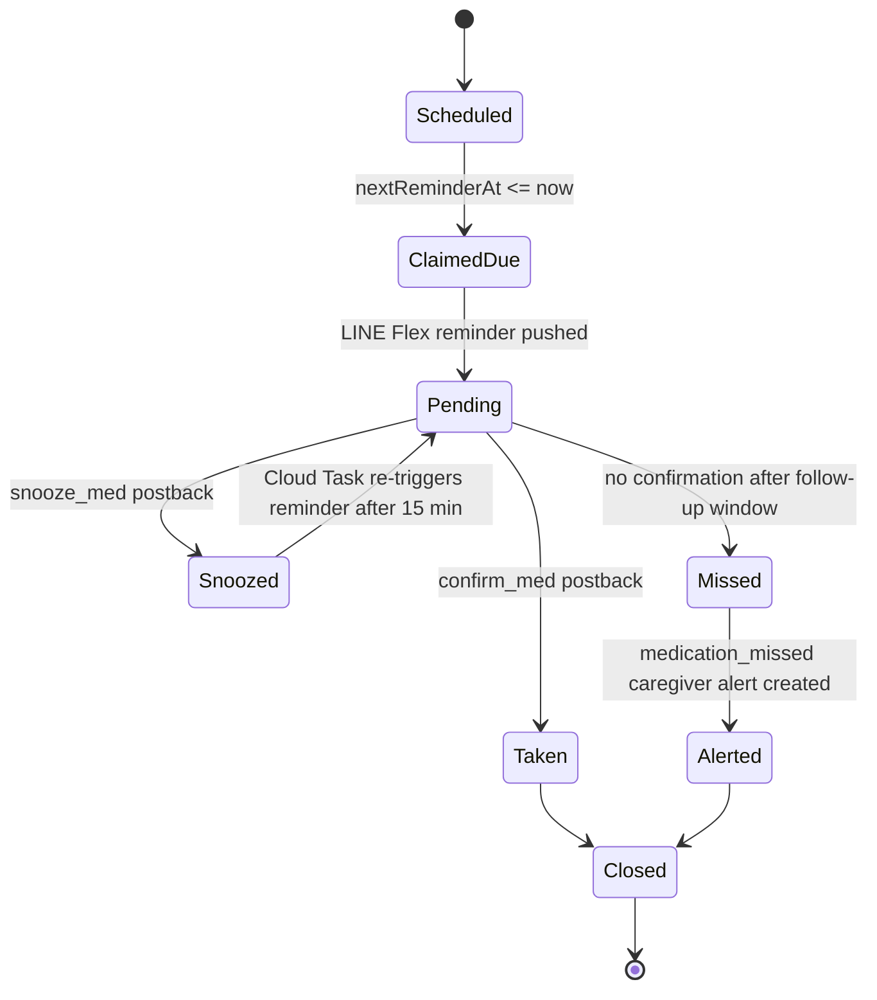

# 03 Technical Specification - Sprint 2 Final As-Built

**Classification:** Confidential  
**Baseline:** Sprint 2 frozen codebase  
**Last synchronized:** 2026-07-17

## 1. Scope

This document captures the Sprint 2 final as-built behavior for the Namo Care medication-alert workflow and the operational latency baseline summarized in the Sprint 2 report. The system utilizes Cloud Tasks and Firestore logic for robust alert queueing and idempotent record creation.

The implemented stack is Firebase/LINE based:

- React 19 + Vite caregiver/elderly dashboard
- Firebase Cloud Functions on Node.js 20
- Firestore as source of truth
- LINE Messaging API for elderly reminders and caregiver alerts
- Firebase Emulator for pre-production verification

## 2. Medication Alert State Machine

### 2.1 As-built state overview

Medication reminders currently span two Firestore concepts:

- `medicationSchedules`: the scheduler source of truth, including `isActive` and `nextReminderAt`.
- `medicationLogs` / `remindersLog`: the runtime reminder/adherence log used by the interactive LINE reminder flow and UAT fixtures.

### 2.2 State definitions

| State | Firestore signal | As-built behavior |
| --- | --- | --- |
| `Scheduled` | `medicationSchedules.isActive == true`, `nextReminderAt` in the future | Reminder exists but is not yet due. |
| `ClaimedDue` | Scheduler transaction bumps `nextReminderAt` and writes `lastSentAt` | The scheduler claims the due reminder before sending so overlapping runs cannot send the same schedule twice. |
| `Pending` | `medicationLogs.status = "PENDING"` or `remindersLog.status = "pending"` | LINE Flex reminder has been sent and is waiting for user action. |
| `Taken` | `status = "taken"`, `takenAt` timestamp | User tapped the `confirm_med` postback. |
| `Snoozed` | `status = "snoozed"` | User tapped `snooze_med`; Cloud Tasks schedules a retry after 15 minutes. |
| `Missed` | `status = "missed"` in missed-dose scenarios | No confirmation arrived inside the accepted follow-up window. |
| `Alerted` | `alerts.type = "medication_missed"`, usually `severity = "medium"` | Caregiver/admin alert is recorded for missed medication. |
| `Closed` | Terminal operational outcome | Reminder ended as taken or escalated/missed. |

### 2.3 Transition rules

1. `sendMedicationReminders` runs every 5 minutes in `asia-southeast1` and queries active schedules where `nextReminderAt <= now`.
2. A Firestore transaction claims each due schedule by updating `lastSentAt`, `nextReminderAt`, and `updatedAt` before dispatch.
3. The primary reminder channel is LINE Flex Message. The message exposes `confirm_med` and `snooze_med` postback actions.
4. `confirm_med` updates the reminder log to `taken` and writes `takenAt`.
5. `snooze_med` updates the reminder log to `snoozed` and creates a Cloud Task that calls the configured medication reminder function URL after 15 minutes.
6. Missed-dose scenarios create `alerts` records with `type = "medication_missed"` and `severity = "medium"`.
7. Scheduler and alert paths are designed for idempotency: schedule claiming uses Firestore transactions, and scheduler alert types use deterministic IDs in the alert service.

### 2.4 Sprint 2 implementation caveat

The frozen tree still contains wiring gaps that must be resolved before treating the medication flow as a clean release gate: `medicationScheduler.ts` dynamically calls `sendInteractiveReminder` and `checkAndFollowUpReminders`, while the checked-in `medicationReminderHandler.ts` exposes the older `sendMedicationReminder` and `handleMedicationPostback` exports. The same handler imports `@google-cloud/tasks`, but that dependency is not currently present in `functions/package.json`. This document records the intended Sprint 2 as-built state machine plus the current source-level integration gaps.

## 3. Sprint 2 Performance Baseline

The Sprint 2 final report established an observed end-to-end medication-alert latency of **approximately 485 ms** under the frozen test baseline.

| Metric | Sprint 2 final value | Release interpretation |
| --- | ---: | --- |
| Medication alert end-to-end latency | ~485 ms | Measured across reminder evaluation, notification handoff, and audit/log update. |
| Operational target | < 500 ms | Target met with roughly 15 ms margin. |
| Regression threshold | >= 500 ms | Treat as a release blocker unless explicitly waived. |

## 4. Acceptance Criteria

- The medication-alert workflow exposes the states and transitions listed above.
- Alert state changes are auditable and safe to replay.
- Smoke testing confirms service health before production deployment (validated via Firebase Emulator).
- Any future latency regression above 500 ms must be treated as a release blocker unless explicitly waived.

## 5. Architecture & PDPA Infrastructure

- **100% Serverless:** Built entirely on Google Cloud Functions and Firestore. This eliminates legacy Kubernetes/Docker DevOps overhead while ensuring automatic scaling and robust disaster recovery (Point-in-Time Recovery).
- **Data Export (Right of Access):** Built-in in-memory PDF generation (`jspdf`) of health signals and telemetry. Files are securely delivered to users via 5-minute signed Google Cloud Storage URLs to guarantee PDPA compliance.
- **Chaos Engineering & Resilience:** Dedicated testing hooks (e.g., `process.env.FUNCTIONS_EMULATOR === 'true'`) allow simulated LINE API failures ("Magic Payload" testing). This ensures the retry queue and dead-letter pipelines function correctly under stress without jeopardizing production data.

## 6. Demo Video & Async Pitch (Phase 2)

As part of the Data Room presentation, an asynchronous **Demo Video (3-5 minutes)** is recommended to demonstrate the medical-grade capabilities of NaMo Care without live setup risks.

### Demo Video Storyboard (Focus: Giant SOS Button)
1. **Introduction (0:00 - 0:30):** High-level overview of NaMo Care's serverless architecture and its resilience against typical infrastructure failures.
2. **The Giant SOS Button (0:30 - 2:00):** 
   - **Action:** User presses the physical or digital SOS button.
   - **Behind the Scenes:** Showcase the Firebase Emulator processing the event under 500ms, triggering the `triggerSos` Cloud Function.
   - **Result:** LINE notification fires instantaneously to the Caregiver's device.
3. **Medication Workflow & Idempotency (2:00 - 3:30):** 
   - Demonstrate the `confirm_med` and `snooze_med` flows.
   - Highlight the idempotency built into the Firestore transactions, preventing double-alerts and duplicate logs.
4. **Conclusion & SLA (3:30 - 5:00):** Emphasize the Demarcation Points (Firebase/LINE bounds) and the 48-hour Source Code Escrow guarantee, assuring enterprise-grade reliability and legal protection.
