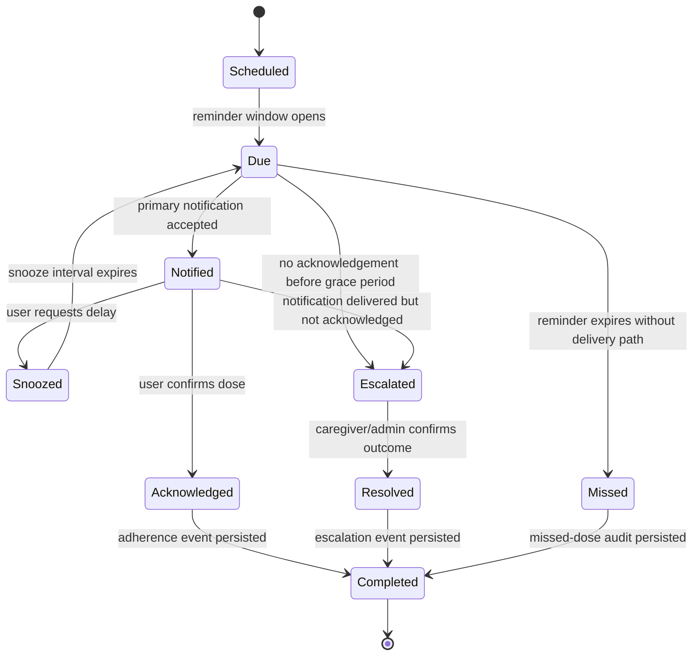

# 03 Technical Specification — Sprint 2 Final As-Built

**Classification:** Confidential  
**Baseline:** Sprint 2 frozen codebase  
**Last synchronized:** 2026-07-17

## 1. Scope

This document captures the Sprint 2 final as-built behavior for the Namo Care medication-alert workflow and the operational performance target measured in the final Sprint 2 report.

## 2. Medication Alert Logic

### 2.1 State machine overview

Medication reminders are modeled as a deterministic state machine so that every alert can be audited, retried safely, and reconciled after app or worker restarts.

### 2.2 State definitions

| State | Purpose | Exit condition |
| --- | --- | --- |
| `Scheduled` | Reminder has been created for a patient medication plan but is not yet inside the delivery window. | Scheduler reaches the configured reminder time. |
| `Due` | Reminder is eligible for dispatch and retry evaluation. | Notification succeeds, the grace period elapses, or the delivery window expires. |
| `Notified` | Primary user notification was accepted by the notification provider/client channel. | User acknowledges, snoozes, or fails to respond before escalation threshold. |
| `Snoozed` | User explicitly deferred the alert. | Snooze interval expires and the reminder returns to `Due`. |
| `Acknowledged` | User confirmed the dose action. | Adherence/audit event is persisted. |
| `Escalated` | The system notified a caregiver/admin path because the patient did not acknowledge in time. | Caregiver/admin resolves the alert. |
| `Resolved` | Human follow-up has recorded the escalation outcome. | Resolution event is persisted. |
| `Missed` | Reminder can no longer be delivered or acknowledged within the accepted medication window. | Missed-dose audit event is persisted. |
| `Completed` | Terminal persisted state for acknowledged, resolved, or missed reminders. | None. |

### 2.3 Transition rules

1. The scheduler must only move `Scheduled` reminders to `Due` when the reminder time is inside the active medication window.
2. `Due` reminders attempt the primary notification channel first. On success they become `Notified`; on delivery-window expiry they become `Missed`.
3. `Notified` reminders become `Acknowledged` only from an explicit user confirmation event.
4. A snooze action is accepted only from `Notified`; it moves the reminder to `Snoozed` and schedules the next `Due` evaluation.
5. If no acknowledgement is recorded before the configured grace period, the reminder becomes `Escalated` and the caregiver/admin notification path is triggered.
6. `Acknowledged`, `Resolved`, and `Missed` reminders must write immutable audit/adherence records before entering `Completed`.
7. Terminal `Completed` reminders are idempotent: replayed worker events must not create duplicate adherence or escalation records.

## 3. Sprint 2 Performance Baseline

The Sprint 2 final report established an observed end-to-end alert latency of **approximately 485 ms** for the medication-reminder path under the frozen test baseline.

| Metric | Sprint 2 final value | Notes |
| --- | ---: | --- |
| Medication alert end-to-end latency | ~485 ms | Measured from due-reminder evaluation through accepted notification/audit handoff in the Sprint 2 report. |
| Operational target | < 500 ms | Sprint 2 freeze target met with ~15 ms margin. |

## 4. Acceptance Criteria

- The medication-alert workflow exposes the states and transitions listed above.
- Alert state changes are auditable and safe to replay.
- Smoke testing confirms service health before production deployment.
- Any future latency regression above 500 ms must be treated as a release blocker unless explicitly waived.
